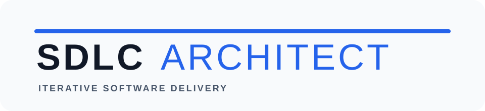

<p align="center">
  
</p>

<p align="center">
  <strong>Iterative software delivery with grounded UML and anti-slop quality gates.</strong>
</p>

<h1 align="center">SDLC Architect</h1>

An agent skill for developing applications through an iterative SDLC workflow with repo-native documentation, Mermaid UML diagrams, and anti-slop quality gates.

## Repository layout

```text
skills/sdlc-architect/
├── SKILL.md
├── agents/openai.yaml
└── references/
    ├── antislop-integration.md
    ├── artifact-templates.md
    ├── execution-protocol.md
    ├── quality-gates.md
    ├── project-governance.md
    ├── sdlc-workflow.md
    └── uml-mermaid.md
```

The root plugin manifests make the skill discoverable as a Codex plugin. The antislop bundle is available beside it under `skills/antislop*`. `skills/antislop-human/` also includes the contrast checker and its MCP launcher. The SDLC skill can also be copied from `skills/sdlc-architect/` into an Agent Skills-compatible skills directory.

## What it covers

- Agile SDLC from discovery through delivery and maintenance.
- Traceability between requirements, design decisions, implementation, and tests.
- Use case, activity, sequence, class/domain, component, and deployment diagrams in Mermaid.
- Anti-slop routing for UI, copy, accessibility, responsive layout, visual assets, and code comments.
- Vendored antislop core plus UI, copywriting, human, mobile, and code-comment concern skills.
- Definition of Ready and Done, security/data review, change impact analysis, and operational delivery gates.
- Reusable artifact templates and behavioral forward-test scenarios.
- Traceability IDs and matrix, phase transitions, risk levels, project baselines, test selection, ADR lifecycle, monorepo boundaries, and maintenance governance.
- Cross-session project state, backlog iteration, evidence grading, command discovery, migration rollback, and isolated forward-test evaluation.

## Validation

Run the repository guardrail check:

```bash
node scripts/check-repo.mjs
node scripts/check-mermaid.mjs
node scripts/check-scenarios.mjs
node scripts/check-governance.mjs
node scripts/check-forward-tests.mjs
```

The skill itself can also be validated with the Codex skill validator:

```bash
python3 /path/to/skill-creator/scripts/quick_validate.py skills/sdlc-architect
```
