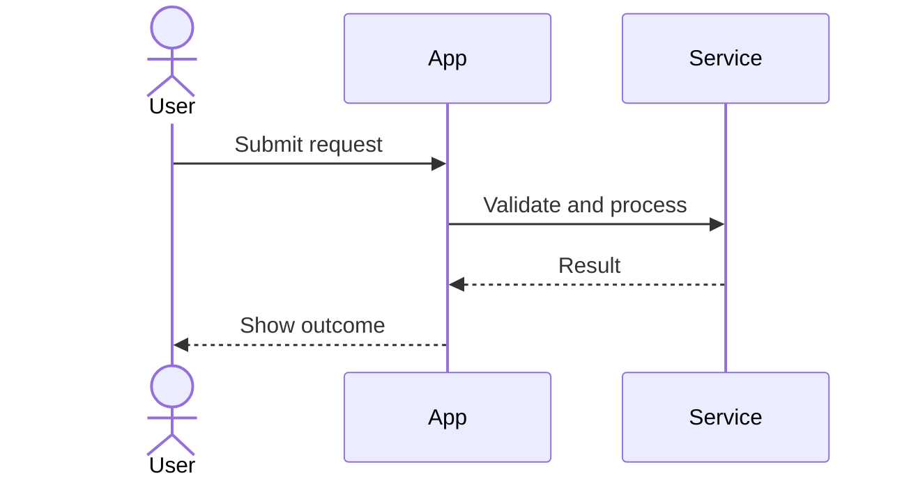

# UML and Mermaid Reference

Use diagrams to make a specific decision, behavior, or boundary easier to inspect. Choose the smallest diagram set that covers the current increment. Mermaid is the default notation because it is reviewable in source control, but preserve an established project notation when one already exists.

## Diagram selection

| Need | Preferred diagram | Include |
| --- | --- | --- |
| Who needs what from the system | Use case | Actors, system boundary, meaningful goals, and relationships only when they clarify scope |
| Rules and branching behavior | Activity | Actions, decisions, guards, parallel work, and terminal outcomes |
| Time-ordered collaboration | Sequence | Participants, messages, responses, validation, failure paths, and external boundaries |
| Domain concepts and relationships | Class or domain model | Important entities/value objects, responsibilities, relationships, and multiplicity when known |
| Runtime or code-level responsibility boundaries | Component/container | Components, interfaces, dependencies, data stores, and trust boundaries |
| Infrastructure and runtime placement | Deployment | Nodes, deployable units, networks or boundaries, and required external services |

State diagrams are useful when an entity has meaningful lifecycle transitions, but are not part of the default set unless the behavior warrants them.

## Modeling rules

- Name elements after the domain or system contract, not vague implementation placeholders.
- Show only relationships supported by requirements, code, or an explicit assumption.
- Keep external actors and systems visibly distinct from internal responsibilities.
- Show alternate, rejected, timeout, and failure paths when they affect acceptance criteria or operational safety.
- Use notes or adjacent prose for assumptions and unresolved decisions; do not hide uncertainty in misleading arrows.
- Prefer one focused diagram over a dense master diagram. Split by behavior, boundary, or audience when a diagram becomes difficult to review.
- Keep terminology identical across requirements, code, tests, and diagrams. If a rename is needed, update all affected artifacts in the same increment.
- Do not use a diagram to imply a protocol, cardinality, transaction boundary, or deployment guarantee that has not been decided.

## Mermaid conventions

Use fenced Mermaid blocks in Markdown:

Choose the Mermaid diagram type that matches the semantic need (`flowchart`, `sequenceDiagram`, `classDiagram`, `stateDiagram-v2`, `C4Context`, or another supported type). Keep labels short and move detailed rules into nearby prose or acceptance criteria.

For flowcharts, use explicit decision labels and outcomes. For sequences, include the meaningful error path when one exists. For class diagrams, avoid adding methods or fields merely because a class can have them. For component or deployment views, identify data stores and external dependencies rather than drawing generic boxes.

## Review checklist

Before finalizing a diagram, check:

1. What question does this diagram answer?
2. Is every element supported by a requirement, existing implementation, or labeled assumption?
3. Does the diagram cover the acceptance criteria's normal and important failure paths?
4. Are names and boundaries consistent with the other artifacts?
5. Can a reviewer understand it without reverse-engineering undocumented intent?
6. Does Mermaid render with the project's chosen renderer or a compatible Mermaid version?

If rendering cannot be checked, validate syntax as far as tooling permits and disclose the limitation.
