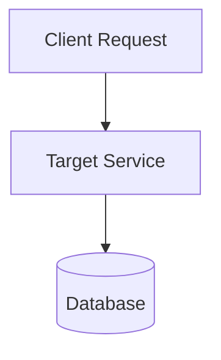

## Summary of Changes

{Provide a concise summary of what this increment changes and the architectural context.}

## Traceability

- **Requirement / User Story**: [{REQ-ID}](docs/requirements.md)
- **Architecture Decision Record**: [{ADR-ID}](docs/adr/{ADR-FILE}.md)
- **Issue Reference**: Resolves #{ISSUE-NUMBER}

## Architectural Diagrams (Mermaid)

## Quality Gates & Definition of Done

- [ ] **Acceptance Criteria**: All criteria verified with automated or manual tests.
- [ ] **Tests & Evidence**: Added unit, contract, or integration tests with passing results.
- [ ] **Anti-Slop Audit**:
  - [ ] UI / Styling: Clean hierarchy, WCAG AA contrast, responsive mobile layout.
  - [ ] Code Hygiene: Meaningful comments explaining *why*; no robotic AI filler or syntax narration.
  - [ ] Copywriting: Direct, concise human language without generic AI fluff.
- [ ] **Security & Data Review**:
  - [ ] Authentication / authorization boundaries enforced.
  - [ ] Input validation applied; secrets externalized.
  - [ ] Zero-downtime migration protocol followed for database changes.
- [ ] **Observability & PRR**:
  - [ ] Structured logging with trace/request ID.
  - [ ] Health / readiness probes unaffected.
- [ ] **Documentation & State**:
  - [ ] `docs/project-state.md` updated with increment outcome.
  - [ ] CHANGELOG.md updated if user-facing behavior changed.
